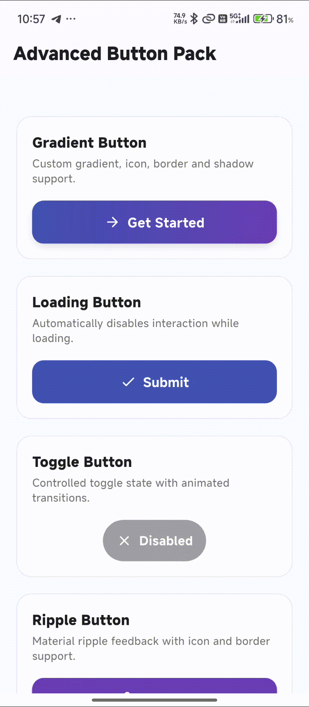

# 🔘 Flutter Advanced Buttons

A customizable Flutter button package that provides **Gradient, Loading, Toggle, and Ripple buttons** for modern Flutter applications.

The package provides reusable button widgets with support for custom colors, icons, animations, loading states, borders, sizing, text styling, padding, elevation, and interaction effects.

## Features

* 🎨 Gradient button
* 🌈 Multiple gradient colors
* ↔️ Custom gradient direction
* ⏳ Loading button
* 🔄 Loading state support
* 🚫 Automatic interaction disabling while loading
* 🔘 Toggle button
* ✅ Active and inactive states
* 🔄 Animated toggle transitions
* 💧 Material ripple button
* 🎯 Custom ripple color
* 🖱️ Tap interaction feedback
* 🖼️ Custom icons
* 🎨 Custom icon colors
* ✏️ Custom text styles
* 📏 Custom width and height
* ⭕ Custom border radius
* 🖌️ Custom borders
* 🌑 Elevation and shadow support
* 🎛️ Custom padding
* 🚫 Disabled state support
* ⚡ Lightweight and reusable
* 📱 Material-based widgets
* 🧩 Easy integration

## Preview



## Installation

Add `flutter_advanced_buttons` to your `pubspec.yaml`.

### Local Package

For local development or testing:

```yaml
dependencies:
  flutter_advanced_buttons:
    path: ../
```

Then run:

```bash
flutter pub get
```

### Pub.dev

After publishing the package to pub.dev, add the latest version:

```yaml
dependencies:
  flutter_advanced_buttons: ^1.0.0
```

Then run:

```bash
flutter pub get
```

## Dependencies

This package uses Flutter's built-in Material components and does not require any additional third-party dependencies.

```yaml
dependencies:
  flutter:
    sdk: flutter
```

## Basic Usage

Import the package:

```dart
import 'package:flutter_advanced_buttons/flutter_advanced_buttons.dart';
```

The package provides four button widgets:

* `AdvancedGradientButton`
* `AdvancedLoadingButton`
* `AdvancedToggleButton`
* `AdvancedRippleButton`

---

# Gradient Button

`AdvancedGradientButton` provides a customizable button with gradient backgrounds, icons, borders, shadows, loading state, and custom sizing.

## Basic Gradient Button

```dart
AdvancedGradientButton(
  text: 'Get Started',
  colors: const [
    Colors.indigo,
    Colors.deepPurple,
  ],
  onPressed: () {
    print('Gradient button pressed');
  },
)
```

## Custom Gradient Direction

```dart
AdvancedGradientButton(
  text: 'Continue',
  colors: const [
    Colors.blue,
    Colors.purple,
  ],
  begin: Alignment.topLeft,
  end: Alignment.bottomRight,
  onPressed: () {},
)
```

## Gradient Button With Icon

```dart
AdvancedGradientButton(
  text: 'Next',
  icon: Icons.arrow_forward,
  colors: const [
    Colors.indigo,
    Colors.deepPurple,
  ],
  onPressed: () {},
)
```

## Gradient Button With Border and Shadow

```dart
AdvancedGradientButton(
  text: 'Submit',
  colors: const [
    Colors.blue,
    Colors.purple,
  ],
  borderColor: Colors.white,
  borderWidth: 1,
  boxShadow: const [
    BoxShadow(
      blurRadius: 10,
      offset: Offset(0, 4),
      color: Color(0x22000000),
    ),
  ],
  onPressed: () {},
)
```

## Gradient Button Loading State

```dart
AdvancedGradientButton(
  text: 'Saving',
  colors: const [
    Colors.indigo,
    Colors.deepPurple,
  ],
  isLoading: true,
  onPressed: () {},
)
```

---

# Loading Button

`AdvancedLoadingButton` provides a standard Material button with a built-in loading state.

When `isLoading` is `true`, the button displays a progress indicator and prevents additional presses.

## Basic Loading Button

```dart
AdvancedLoadingButton(
  text: 'Submit',
  onPressed: () {},
)
```

## Loading State

```dart
AdvancedLoadingButton(
  text: 'Submit',
  isLoading: true,
  onPressed: () {},
)
```

## Custom Loading Indicator

```dart
AdvancedLoadingButton(
  text: 'Processing',
  isLoading: true,
  loadingColor: Colors.white,
  loadingSize: 22,
  loadingStrokeWidth: 2,
  onPressed: () {},
)
```

## Loading Button With Icon

```dart
AdvancedLoadingButton(
  text: 'Save',
  icon: Icons.save,
  backgroundColor: Colors.indigo,
  onPressed: () {},
)
```

## Custom Button Styling

```dart
AdvancedLoadingButton(
  text: 'Continue',
  width: 220,
  height: 52,
  borderRadius: 14,
  backgroundColor: Colors.deepPurple,
  textColor: Colors.white,
  onPressed: () {},
)
```

---

# Toggle Button

`AdvancedToggleButton` provides a controlled toggle button with active and inactive states.

The button supports custom text, icons, colors, animation duration, animation curve, sizing, and disabled state.

## Basic Toggle Button

```dart
bool isEnabled = false;

AdvancedToggleButton(
  value: isEnabled,
  onChanged: (value) {
    setState(() {
      isEnabled = value;
    });
  },
)
```

## Custom Active and Inactive Text

```dart
AdvancedToggleButton(
  value: isEnabled,
  activeText: 'Enabled',
  inactiveText: 'Disabled',
  onChanged: (value) {
    setState(() {
      isEnabled = value;
    });
  },
)
```

## Toggle Button With Icons

```dart
AdvancedToggleButton(
  value: isEnabled,
  activeText: 'ON',
  inactiveText: 'OFF',
  activeIcon: Icons.check,
  inactiveIcon: Icons.close,
  onChanged: (value) {
    setState(() {
      isEnabled = value;
    });
  },
)
```

## Custom Toggle Colors

```dart
AdvancedToggleButton(
  value: isEnabled,
  activeColor: Colors.green,
  inactiveColor: Colors.grey,
  activeTextColor: Colors.white,
  inactiveTextColor: Colors.white,
  onChanged: (value) {
    setState(() {
      isEnabled = value;
    });
  },
)
```

## Custom Animation

```dart
AdvancedToggleButton(
  value: isEnabled,
  animationDuration: const Duration(milliseconds: 350),
  animationCurve: Curves.easeInOut,
  onChanged: (value) {
    setState(() {
      isEnabled = value;
    });
  },
)
```

## Disabled Toggle Button

```dart
AdvancedToggleButton(
  value: isEnabled,
  enabled: false,
  onChanged: (value) {},
)
```

---

# Ripple Button

`AdvancedRippleButton` provides Material ripple feedback when the user interacts with the button.

It supports custom ripple colors, icons, borders, elevation, sizing, and text styling.

## Basic Ripple Button

```dart
AdvancedRippleButton(
  text: 'Tap Me',
  onPressed: () {
    print('Button pressed');
  },
)
```

## Custom Ripple Color

```dart
AdvancedRippleButton(
  text: 'Tap Me',
  backgroundColor: Colors.indigo,
  rippleColor: Colors.white,
  onPressed: () {},
)
```

## Ripple Button With Icon

```dart
AdvancedRippleButton(
  text: 'Continue',
  icon: Icons.arrow_forward,
  onPressed: () {},
)
```

## Ripple Button With Border

```dart
AdvancedRippleButton(
  text: 'Submit',
  borderColor: Colors.indigo,
  borderWidth: 1,
  onPressed: () {},
)
```

## Ripple Button With Elevation

```dart
AdvancedRippleButton(
  text: 'Elevated Button',
  elevation: 4,
  backgroundColor: Colors.indigo,
  onPressed: () {},
)
```

---

# Custom Sizing

All supported buttons provide width and height customization.

```dart
AdvancedGradientButton(
  text: 'Custom Size',
  width: 250,
  height: 55,
  colors: const [
    Colors.blue,
    Colors.purple,
  ],
  onPressed: () {},
)
```

You can also use:

```dart
width: double.infinity,
```

to make a button fill the available horizontal space.

---

# Custom Text Style

Buttons support custom `TextStyle` values.

```dart
AdvancedGradientButton(
  text: 'Custom Text',
  colors: const [
    Colors.indigo,
    Colors.deepPurple,
  ],
  textStyle: const TextStyle(
    color: Colors.white,
    fontSize: 18,
    fontWeight: FontWeight.bold,
  ),
  onPressed: () {},
)
```

The same approach can be used with the loading, toggle, and ripple buttons.

---

# Custom Icons

Buttons can optionally display an icon alongside the button text.

```dart
AdvancedRippleButton(
  text: 'Download',
  icon: Icons.download,
  iconSize: 22,
  iconColor: Colors.white,
  onPressed: () {},
)
```

Icons are optional, so buttons can also be used without them.

---

# Disabled State

Buttons can be disabled by providing `null` to `onPressed`.

```dart
AdvancedRippleButton(
  text: 'Disabled',
  onPressed: null,
)
```

For the loading button, the button is automatically disabled while loading:

```dart
AdvancedLoadingButton(
  text: 'Saving',
  isLoading: true,
  onPressed: () {},
)
```

The gradient button also prevents interaction while loading:

```dart
AdvancedGradientButton(
  text: 'Saving',
  isLoading: true,
  colors: const [
    Colors.indigo,
    Colors.deepPurple,
  ],
  onPressed: () {},
)
```

---

# API Reference

## AdvancedGradientButton

| Property        | Type                 | Default                 | Description                |
| --------------- | -------------------- | ----------------------- | -------------------------- |
| `text`          | `String`             | Required                | Button label               |
| `onPressed`     | `VoidCallback?`      | Required                | Button callback            |
| `colors`        | `List<Color>`        | Required                | Gradient colors            |
| `begin`         | `Alignment`          | `Alignment.centerLeft`  | Gradient start position    |
| `end`           | `Alignment`          | `Alignment.centerRight` | Gradient end position      |
| `width`         | `double?`            | `null`                  | Button width               |
| `height`        | `double`             | `50`                    | Button height              |
| `borderRadius`  | `double`             | `12`                    | Corner radius              |
| `padding`       | `EdgeInsetsGeometry` | `horizontal: 20`        | Button padding             |
| `textStyle`     | `TextStyle?`         | `null`                  | Custom text style          |
| `icon`          | `IconData?`          | `null`                  | Optional icon              |
| `iconSize`      | `double`             | `20`                    | Icon size                  |
| `iconColor`     | `Color?`             | `null`                  | Icon color                 |
| `borderColor`   | `Color?`             | `null`                  | Border color               |
| `borderWidth`   | `double`             | `0`                     | Border width               |
| `boxShadow`     | `List<BoxShadow>?`   | `null`                  | Button shadows             |
| `isLoading`     | `bool`               | `false`                 | Displays loading indicator |
| `loadingColor`  | `Color?`             | `null`                  | Loading indicator color    |
| `loadingSize`   | `double`             | `20`                    | Loading indicator size     |
| `disabledColor` | `Color?`             | `null`                  | Disabled background color  |

## AdvancedLoadingButton

| Property             | Type                 | Default          | Description                    |
| -------------------- | -------------------- | ---------------- | ------------------------------ |
| `text`               | `String`             | Required         | Button label                   |
| `onPressed`          | `VoidCallback?`      | Required         | Button callback                |
| `isLoading`          | `bool`               | `false`          | Displays loading indicator     |
| `width`              | `double?`            | `null`           | Button width                   |
| `height`             | `double`             | `50`             | Button height                  |
| `borderRadius`       | `double`             | `12`             | Corner radius                  |
| `backgroundColor`    | `Color`              | `Colors.blue`    | Button background              |
| `disabledColor`      | `Color`              | `Colors.grey`    | Disabled background            |
| `textColor`          | `Color?`             | `null`           | Text color                     |
| `textStyle`          | `TextStyle?`         | `null`           | Custom text style              |
| `icon`               | `IconData?`          | `null`           | Optional icon                  |
| `iconSize`           | `double`             | `20`             | Icon size                      |
| `iconColor`          | `Color?`             | `null`           | Icon color                     |
| `loadingColor`       | `Color?`             | `null`           | Loading indicator color        |
| `loadingSize`        | `double`             | `20`             | Loading indicator size         |
| `loadingStrokeWidth` | `double`             | `2.5`            | Loading indicator stroke width |
| `padding`            | `EdgeInsetsGeometry` | `horizontal: 20` | Button padding                 |
| `borderSide`         | `BorderSide?`        | `null`           | Button border                  |
| `boxShadow`          | `List<BoxShadow>?`   | `null`           | Shadow configuration           |

## AdvancedToggleButton

| Property            | Type                 | Default            | Description                     |
| ------------------- | -------------------- | ------------------ | ------------------------------- |
| `value`             | `bool`               | Required           | Current toggle state            |
| `onChanged`         | `ValueChanged<bool>` | Required           | State change callback           |
| `activeText`        | `String`             | `ON`               | Active label                    |
| `inactiveText`      | `String`             | `OFF`              | Inactive label                  |
| `activeIcon`        | `IconData?`          | `null`             | Active icon                     |
| `inactiveIcon`      | `IconData?`          | `null`             | Inactive icon                   |
| `activeColor`       | `Color`              | `Colors.green`     | Active background               |
| `inactiveColor`     | `Color`              | `Colors.grey`      | Inactive background             |
| `activeTextColor`   | `Color?`             | `null`             | Active text color               |
| `inactiveTextColor` | `Color?`             | `null`             | Inactive text color             |
| `textStyle`         | `TextStyle?`         | `null`             | Custom text style               |
| `width`             | `double?`            | `null`             | Button width                    |
| `height`            | `double`             | `48`               | Button height                   |
| `borderRadius`      | `double`             | `24`               | Corner radius                   |
| `padding`           | `EdgeInsetsGeometry` | `horizontal: 16`   | Button padding                  |
| `animationDuration` | `Duration`           | `250ms`            | Transition duration             |
| `animationCurve`    | `Curve`              | `Curves.easeInOut` | Animation curve                 |
| `enabled`           | `bool`               | `true`             | Enables or disables interaction |

## AdvancedRippleButton

| Property          | Type                 | Default          | Description        |
| ----------------- | -------------------- | ---------------- | ------------------ |
| `text`            | `String`             | Required         | Button label       |
| `onPressed`       | `VoidCallback?`      | Required         | Button callback    |
| `backgroundColor` | `Color`              | `Colors.blue`    | Button background  |
| `rippleColor`     | `Color`              | `Colors.white24` | Ripple color       |
| `textColor`       | `Color?`             | `null`           | Text color         |
| `textStyle`       | `TextStyle?`         | `null`           | Custom text style  |
| `icon`            | `IconData?`          | `null`           | Optional icon      |
| `iconSize`        | `double`             | `20`             | Icon size          |
| `iconColor`       | `Color?`             | `null`           | Icon color         |
| `width`           | `double?`            | `null`           | Button width       |
| `height`          | `double`             | `50`             | Button height      |
| `borderRadius`    | `double`             | `12`             | Corner radius      |
| `padding`         | `EdgeInsetsGeometry` | `horizontal: 20` | Button padding     |
| `elevation`       | `double`             | `0`              | Material elevation |
| `borderColor`     | `Color?`             | `null`           | Border color       |
| `borderWidth`     | `double`             | `0`              | Border width       |

---

# How It Works

The package is built using Flutter's standard widget and Material APIs.

### Gradient Button

Uses `LinearGradient` to create customizable gradient backgrounds and `InkWell` for interaction.

### Loading Button

Uses a boolean `isLoading` state to switch between the button content and a `CircularProgressIndicator`.

### Toggle Button

Uses a controlled boolean value and `AnimatedContainer` / `AnimatedSwitcher` to provide animated active and inactive states.

### Ripple Button

Uses Flutter's Material `Ink` and `InkWell` widgets to provide configurable ripple feedback.

No external state-management package is required.

---

# Example App

The package includes an example application demonstrating all four buttons:

* Gradient Button
* Loading Button
* Toggle Button
* Ripple Button

The example also demonstrates:

* Custom icons
* Custom colors
* Loading states
* Toggle state changes
* Ripple interaction
* Button sizing
* Borders
* Shadows
* Elevation

---

# Project Structure

```text
flutter_advanced_buttons/
│
├── lib/
│   ├── flutter_advanced_buttons.dart
│   └── src/
│       ├── gradient_button.dart
│       ├── loading_button.dart
│       ├── toggle_button.dart
│       └── ripple_button.dart
│
├── example/
│   ├── lib/
│   │   └── main.dart
│   └── assets/
│       └── demo.gif
│
├── test/
│
├── README.md
├── CHANGELOG.md
├── LICENSE
└── pubspec.yaml
```

---

# Requirements

* Flutter 3.35.5 or compatible
* Dart 3.9.2 or compatible
* Flutter Material support

The package does not require any additional third-party dependencies.

---

# Running the Example

Clone the repository:

```bash
git clone https://github.com/RuhanShaikh123/flutter_advanced_buttons.git
```

Navigate to the package:

```bash
cd flutter_advanced_buttons
```

Get dependencies:

```bash
flutter pub get
```

Run the example application:

```bash
cd example
flutter run
```


# License

MIT License

Copyright (c) 2026 Excelsior Technologies

Permission is hereby granted, free of charge, to any person obtaining a copy
of this software and associated documentation files (the "Software"), to deal
in the Software without restriction, including without limitation the rights
to use, copy, modify, merge, publish, distribute, sublicense, and/or sell
copies of the Software, and to permit persons to whom the Software is
furnished to do so, subject to the following conditions:

The above copyright notice and this permission notice shall be included in all
copies or substantial portions of the Software.

THE SOFTWARE IS PROVIDED "AS IS", WITHOUT WARRANTY OF ANY KIND, EXPRESS OR
IMPLIED, INCLUDING BUT NOT LIMITED TO THE WARRANTIES OF MERCHANTABILITY,
FITNESS FOR A PARTICULAR PURPOSE AND NONINFRINGEMENT. IN NO EVENT SHALL THE
AUTHORS OR COPYRIGHT HOLDERS BE LIABLE FOR ANY CLAIM, DAMAGES OR OTHER
LIABILITY, WHETHER IN AN ACTION OF CONTRACT, TORT OR OTHERWISE, ARISING FROM,
OUT OF OR IN CONNECTION WITH THE SOFTWARE OR THE USE OR OTHER DEALINGS IN THE
SOFTWARE.
 
